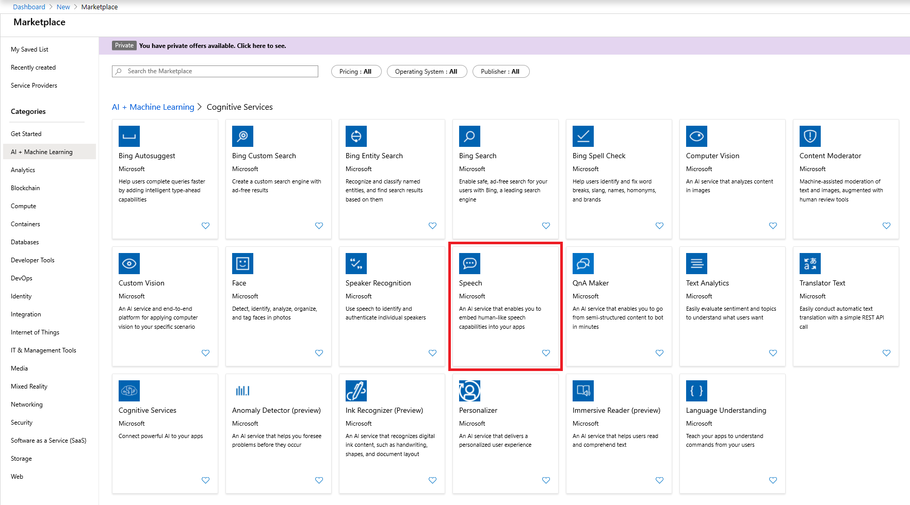
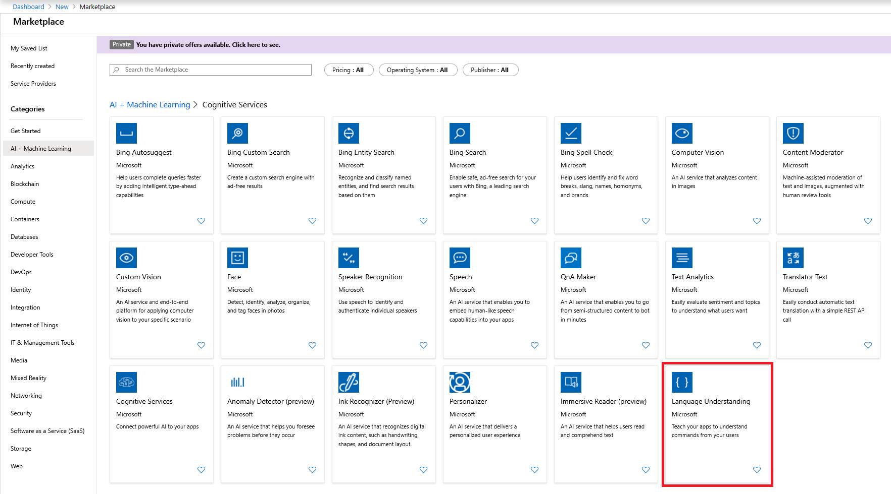
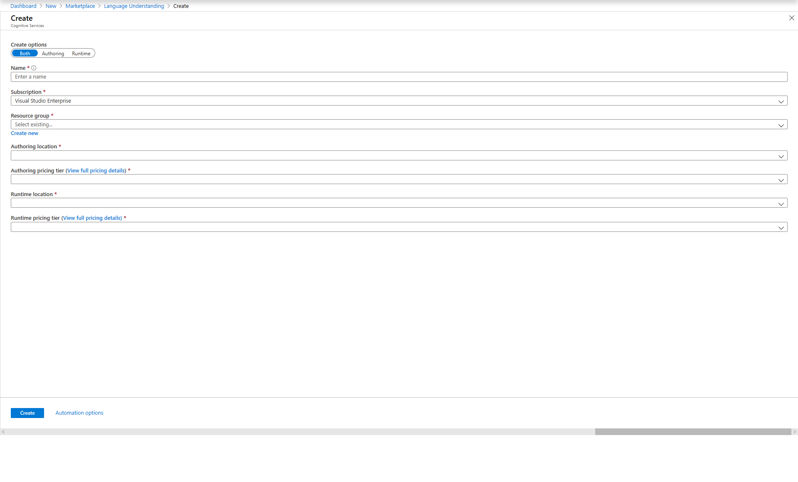

# CognitiveService-IoTEdge

## Environment

- Visual Studio Code
- IoT Edge Extension  
    <https://marketplace.visualstudio.com/items?itemName=vsciot-vscode.azure-iot-edge>
- Azure IoT Hub Toolkit  
    <https://marketplace.visualstudio.com/items?itemName=vsciot-vscode.azure-iot-toolkit>
- Azure IoT Hub  
    Create IoT Hub and register your IoT Edge Device
- IoT Edge Device  
    Set up Azure IoT Edge using a physical device.  

    Tested with Intel NUC with Ubuntu 18.04.
- A microphone device  
    Built-in Microphone on your laptop is ok.  Recommend to have array mic or headset for better recognition.  

    Tested with Jabra Speaker

## 1 : Create Azure Resources

### 1.1 : Speech API

Create Cognitive Service Speech



### 1.2 : LUIS

Create Cognitive Serivce Language Understanding



Creta both Authoring and Runtime



## 2 : Clone the repo

e.g. Clone to C:\SpeechLuis

```bash

git clone https://github.com/daisukeiot/CognitiveService-IoTEdge.git C:\SpeechLuis

```

## 3 : Open with VSCode

e.g. Open C:\SpeechLuis with VS Code

```bash

code c:\SpeechLuis

```

## 4 : Set Environment Variables

Open `.env` file and set following values

|Variable                  |Description  |Example  |
|--------------------------|---------|---------|
|CONTAINER_PREVIEW_URL     | Registory Address for Preview Container (Speech)        |containerpreview.azurecr.io |
|CONTAINER_PREVIEW_USER    | User Name (GUID) received for Preview Container Access  | 00000000-1111-2222-3333-444444444444 |
|CONTAINER_PREVIEW_PASS    | Password (GUID) received for Preview Container Access   | 00000000-1111-2222-3333-444444444444 |
|SPEECH_CONTAINER_ENDPOINT | Endpoint value from Azure Portal                        | https://westus2.api.cognitive.microsoft.com/sts/v1.0/issuetoken |
|SPEECH_CONTAINER_API_KEY  | API Key from Speech API Resource  | 123456789abcdefghijklmnopqrstuvw |
|SPEECH_CONTAINER_PORT     | Port number on Host to map to the container             | 5000        |
|LUIS_CONTAINER_ENDPOINT   | Endpoint value from [Azure Portal](https://docs.microsoft.com/en-us/azure/cognitive-services/luis/luis-container-howto?tabs=v3#endpoint-uri-endpoint_uri)                        | https://luiscontainer.cognitiveservices.azure.com/ |
|LUIS_CONTAINER_API_KEY    | API Key from LUIS API Runtime Resource from [Azure Portal](https://docs.microsoft.com/en-us/azure/cognitive-services/luis/luis-container-howto?tabs=v3#keys-api_key)                  | 123456789abcdefghijklmnopqrstuvw |
|LUIS_CONTAINER_PORT       | Port number on Host to map to the container             | 5001        |

## 5. Generate Deployment Manifest

Right Click on `deployment.template.json` and select `Generate IoT Edge Deployment Manifest`

This will create `config\deployment.amd64.json`

## 6. Deploy to your device

You must select IoT Hub using Azure IoT Hub extension before deploying to your IoT Edge Device